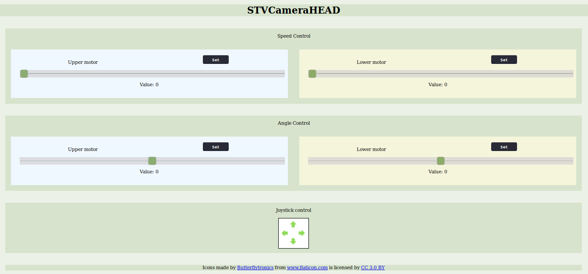

# STVCameraHEAD
In this project we control the movement of two step motors using the Arduino Uno R3. It is possible 
to do it with the joystick or via webpage. The project is design in such a way that none of the user's 
inputs or power blackouts can destabilize the system or tangle the wires.

# Getting Software
In order to use the STVCameraHEAD we just need to download:
- [the Arduino IDE](https://www.arduino.cc/en/Main/Software)
- [the code](https://github.com/hobitolog/STVCameraHEAD)
- any preferable text editor of your choice


# Where to start?

## IP configuration

In case of connecting out system to the new network we need to check the ip of the current router. We can do it in two ways:
- manually (it should be somewhere on the router's case, usually on the bottom)
- by the software (this depends on the operating system):
1. *WINDOWS* - open cmd -> call ipconfig -> read the network gateway and the mask
2. *LINUX* - open terminal -> call ifconfig -> read our ip and the mask

Example output
```
wlan0: flags=xxxx<UP,BROADCAST,RUNNING,MULTICAST>  mtu yyyy
        inet 192.168.0.10  netmask 255.255.255.0  broadcast 192.168.0.255
```

Following these information it's rather easy to deduce available address span. Write down some possible combinations and save it for further work.

Suppose we have obtained our ip address 192.168.0.10 and the mask 255.255.255.0, then we can choose from 256 hosts, but beware of already connected devices. It's safe then to select the one from the middle, for example:
192.168.0.177.

Now go to the Header.h file and press Ctrl-F and type "IPAddress". It should take you straight to the the line in the code where ip address is set. 

```c++
/* Replace octets to match your network */
IPAddress ip(192, 168, 0, 177);

```

From no on it should all work as expected. 
Open Arduino IDE,  connect the ethernet cable to the Arduino board, power up the hardware components and run the program.

## IP configuration (extra bonus)

If method above didn't workout it means that the network is probably densly populated. In this case it can be hard to have luck and hit the mark at once.

Try then downloading [nmap software](https://nmap.org/) and scan the network for available free addresses.

## Arduino code

Arduino code is divided into two separate file in the name of readability - Header.h and STVCH.ino.

## Web page code

After testing different combinations for Arduino it appears to be best to have a single file both with html, css an javascript inside it. 
User does not have to make any changes in the code unless he desperately wants to. Keep in mind to put the index.htm file onto your sd card and insert it into the Arduino Ethernet Shield. Otherwise it will be pretty hard to do anything.

## Summary

After steps above you should be able to fire up and use the camera head.

# How to use?

## Overview

Configure the camera head as stated above.
Connect your laptop to the network, open web-browser and type the address of the camera head you obtained during  configuration process


Then the following webpage should appear:



It's divided into 3 main sections - Speed Control, Angle Control and Joystick Control.

Speed Control and Angle Control are sliders with value feedback, and Joystick Control is a panel to click/touch and hold the cursor in order to move the camera head.

### Speed Control

Default values are set to zero and you can change them at your will. The changes will affect the speed of steppers both in online control or by physical joystick.

### Angle Control

Set angle you want and it will make the camera head move in the desired direction (point-to-point movement).

### Joystick Control

Touch/click to move the camera head in the desired direction.


# Built With
- [Accelstepper.h](https://www.arduinolibraries.info/libraries/accel-stepper)
- [Multistepper.h](http://www.airspayce.com/mikem/arduino/AccelStepper/classMultiStepper.html)
- [Ethernet.h](https://www.arduinolibraries.info/libraries/ethernet)
- [SPI.h](https://www.arduino.cc/en/Reference/SPI)
- [SD.h](https://www.arduino.cc/en/Reference/SD)


# License
This project is licensed under the MIT License. The licence should be downloaded with the github code, if not you can find it [here.](https://github.com/hobitolog/STVCameraHEAD/blob/master/LICENSE)

# Authors
- Adam Banaszczyk
- Krzysztof Stężała
